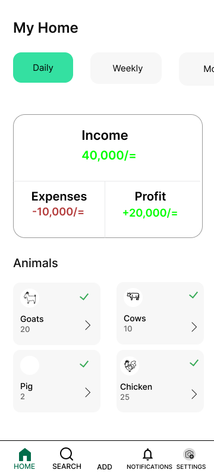
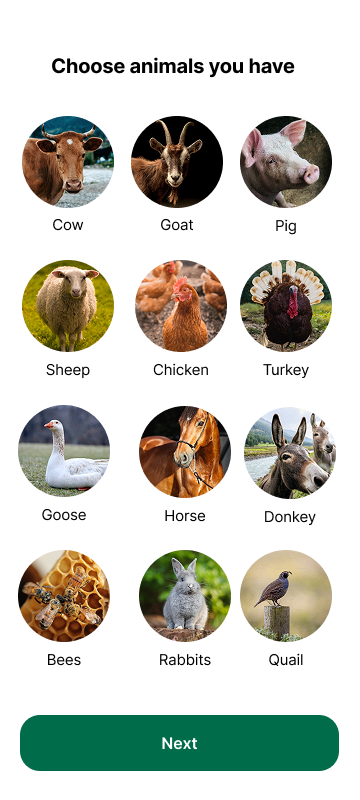

.# Farm Tracker 🚜


**Farm Tracker** is a comprehensive management tool designed to help farmers digitize their operations. From tracking expenses and income to managing livestock and supply inventory, this application simplifies the complex logistics of running a modern farm.

---

## 📱 UI & Prototype

> **Design:** The interface is built with **Jetpack Compose**, focusing on high contrast and readability for outdoor use.

<p align="center">
  
  &nbsp;&nbsp;&nbsp;&nbsp;
  
</p>

**View the Full Prototype:**
https://www.figma.com/proto/l5QmZUVDHeqosahTKg7SQY/Untitled?node-id=5-323&t=8UoTD8KU34SJVJpT-0&scaling=scale-down&content-scaling=fixed&page-id=0%3A1&starting-point-node-id=5%3A323

---

## ✨ Core Features

* **💰 Finance Management:** Record farm income and expenses to generate profit/loss insights.
* **📦 Supply Inventory:** Track feed, seeds, fertilizers, and equipment to prevent stockouts.
* **🐮 Livestock Tracking:** Monitor animal details, health records, and breeding cycles.
* **☁️ Cloud Sync & Offline Mode:** Uses **Room Database** for offline access (essential for remote fields) and syncs with **Firebase** when connectivity is restored.

---

## 🛠 Technical Stack

This project demonstrates enterprise-level Android development practices, utilizing a multi-module architecture for scalability.

* **Language:** Kotlin
* **UI Framework:** Jetpack Compose
* **Architecture:** MVVM (Model-View-ViewModel)
* **Dependency Injection:** Dagger Hilt
* **Backend/Auth:** Firebase
* **Local Persistence:** Room Database

---

## 🏗 Modular Architecture

The application is modularized to enforce separation of concerns and improve build times:

* **:app** - The application entry point and navigation graph.
* **:core** - Common utilities, extensions, and base classes used across modules.
* **:data** - Repository implementations and data sources (Room & Firebase).
* **:domain** - Use cases and business logic models.
* **:features** - Standalone feature modules:
    * `:features:finance`
    * `:features:inventory`
    * `:features:livestock`

---

## 💻 Setup & Installation

To run this project locally:

1.  **Clone the repository:**
    ```bash
    git clone [https://github.com/yourusername/FarmTracker.git](https://github.com/victesa/FarmTracker.git)
    ```

2.  **Firebase Configuration:**
    * This project relies on Firebase. You must add your own `google-services.json` file to the `:app` module root directory.

3.  **Build & Run:**
    * Open in Android Studio.
    * Sync Gradle.
    * Run on an Emulator or Device.

---

## ⚠️ Project Status

**Status:** *Portfolio Project / Closed Source*

This application serves as a demonstration of modern Android architecture and is not currently open for public contribution.

---

## 📄 License

Copyright © 2025. All Rights Reserved.